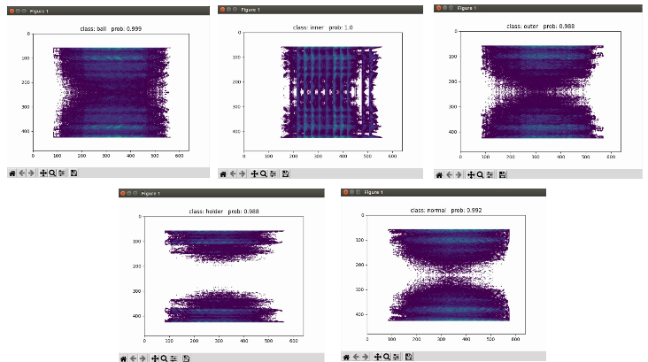

# Efficient-GANomaly

This repository contains PyTorch implementation of a competition for malfunction signal detection.

## Table of Contents
- [GANomaly](#ganomaly)
    - [Installation](#installation)
    - [Dataset](#dataset)
    - [Training](#training)
    
## 1. Installation
1. First clone the repository
   ```
   git clone https://github.com/samet-akcay/ganomaly.git
   ```
2. Create the virtual environment via conda
    ```
    conda create -n Efficient-GANomaly python=3.7
    ```
3. Activate the virtual environment.
    ```
    conda activate Efficient-GANomaly
    ```
3. Install the dependencies.
   ```
   conda install -c intel mkl_fft
   pip install --user --requirement requirements.txt
   ```
## 2. Contest Problems
Precisely classify 5 kind of breakdown signals form 3 different working condition, condition0 and condition1 samples are labeled while that condition2 are not, all these samples can be used to train.(The training dataset and testing dataset are all numpy files ended with .npy)


## 3. Training
1. Mix condition0 and condition1 datasets(Mix01) training EfficientNet for 5 classification. 
   ```
   python train_step1.py
   ```
2. Merge condition2 classification results to Mix01(Mix012) training GANomaly for abnormal detection. 
    ```
    python train_step2.py
    ```
3. Finally, load all trained models, using Mix012 to train Classifier
    ```
    python train_final.py
    ```

# 4.Results
The testing result is as bellow:



